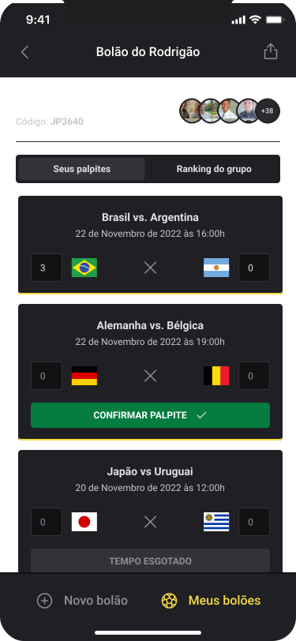

<h1 align="center">
    
      
        
</h1>

 

## :rocket: Tecnologias

Esse projeto foi desenvolvido com as seguintes tecnologias:

- [Expo](https://expo.io/)
- [React Native](https://reactnative.dev/)
- [TypeScript](https://www.typescriptlang.org/)
- [React Native Svg-Transformer](https://github.com/kristerkari/react-native-svg-transformer)
- [Expo Auth Session](https://docs.expo.dev/versions/latest/sdk/auth-session/)
- [Expo Web Browser](https://docs.expo.dev/versions/v46.0.0/sdk/webbrowser/)
- [API GOOGLE](https://console.cloud.google.com)
- [PhosphorIcons](https://phosphoricons.com/)
- [Axios](https://www.npmjs.com/package/axios)
- [Country-List](https://www.npmjs.com/package/country-list)
- [DayJS](https://www.npmjs.com/package/dayjs)
- [dotENV](https://www.npmjs.com/package/dotenv)

------------------------ || -------------------------

- [X] npx create-expo-app nlwcopamobile

* npx expo start

- [X] npm install native-base

- [X] npx expo install react-native-svg@12.1.1

- [X] expo install react-native-safe-area-context@3.3.2

- [X] npx expo install expo-font expo-google-fonts/roboto

- [X] npm i react-native-svg-transformer

- [X] npx expo install expo-auth-session expo-random

- [X] npx expo install expo-web-browser

* https://docs.expo.dev/guides/authentication/

* https://console.cloud.google.com

->  URIs (Authorized JavaScript origins): https://auth.expo.io
-> Authorized redirect URIs: https://auth.expo.io/@alissonandrade/nlwcopamobile

- [X] npm install --save phosphor-react-native

* npx expo start --clear

